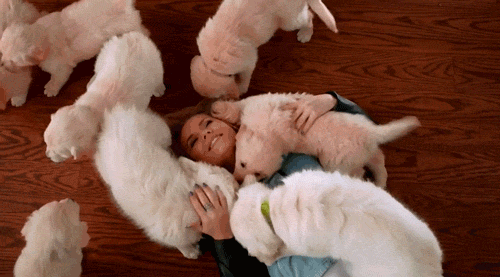
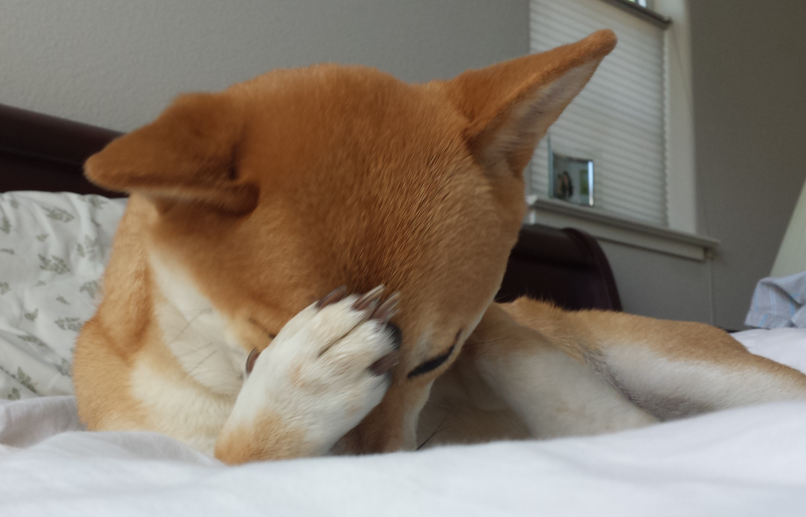
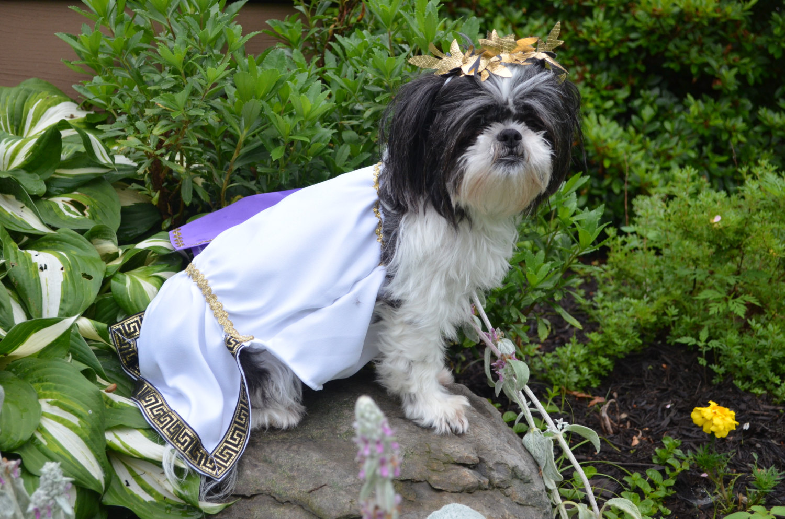
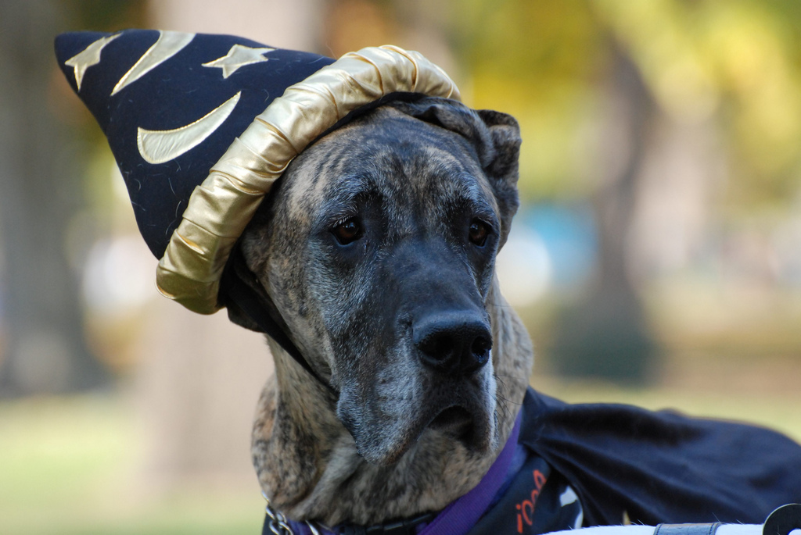
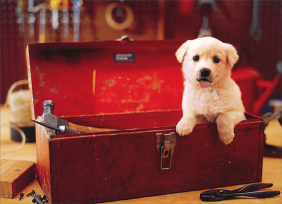
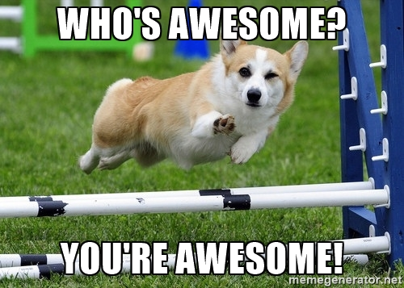

# In Action

## Contributing to OSS

---

<!-- _footer: "" -->

# <!--fit--> Hi! :wave: I'm Sean

- :bird: [sjkilleen](https://twitter.com/sjkilleen)
- :earth_americas: [SeanKilleen.com](https://seankilleen.com)
- :briefcase: [Excella](https://excella.com)

---

## There's a saying

---

## And speaking of new dogs

---
<!-- _footer: "" -->

---

#

#

#

# The Layout

- Why OSS Matters
- OSS Myths
- Terms &amp; Tools
- PR Practices
- Get Started!

---

## Why OSS Matters To the World

#

#

#

#

---

#### Why OSS Matters To the World

## Transparency

---

#### Why OSS Matters To the World

## Security

---

#### Why OSS Matters To the World

## Integration

---

#### Why OSS Matters To the World

## The Scouting Rule

---

#### Why OSS Matters To the World

## The Shoulders of Giants

---
<!-- _footer: "" -->

## Why OSS Matters To You

---

#### Why OSS Matters To You

## Find Your Passion

---

#### Why OSS Matters To You

## Find Your Strengths

---

#### Why OSS Matters To You

## Community

---

#### Why OSS Matters To You

## Recognition

---

#### Why OSS Matters To You

## Curiosity

---

#### Why OSS Matters To You

## Fulfillment

---

#### Why OSS Matters To You

## Easy to Remember

## EFFCRCF

---
<!-- _footer: "" -->

---
<!-- _footer: "" -->

## Why OSS Matters Right Now

---

#### Why OSS Matters Right Now

## Portfolio Building

---

#### Why OSS Matters Right Now

## Learn Skills Quickly

---

#### Why OSS Matters Right Now

## Networking

---

#### Why OSS Matters Right Now

## Marketability

---

#### Why OSS Matters Right Now

## (Async) Communication Skills

---

#### Why OSS Matters Right Now

## Working in the Open

---
<!-- _footer: "" -->

# OSS Myths

---
<!-- _footer: "" -->

<!-- You don't have to be a wizard -->

---

<!-- _footer: "" -->

<!-- You don't have to even submit code  -->

---
<!-- _footer: "" -->

<!-- Folks love docs too! -->

---
<!-- _footer: "" -->

<!-- Myth: harsh criticism and divas -->

---

<!-- _footer: "" -->

<!-- Myth: huge time commitment / tiring -->

---
<!-- _footer: "" -->

<!-- Myth: nobody knows me, who am I? -->

---

## Terms &amp; Tools

---

#### Terms &amp; Tools

## Git (Source Control)

---

#### Terms &amp; Tools

## Issue

---

#### Terms &amp; Tools

## Branch

---
<!-- _footer: "" -->

---

---

#### Terms &amp; Tools

## Pull Request (PR)

---

## PR Practices

---

#### PR Practices

## 1. Open an Issue

---

#### PR Practices

## 2. Discuss the Change

---

#### PR Practices

## 3. Create a Branch

---

#### PR Practices

## 4. Create an Early PR

---

#### PR Practices

## 5. Show Your Work

---

## Get Started

- [up-for-grabs.net](http://up-for-grabs.net)
- [github.com/excellalabs](http://github.com/excellalabs)

---
<!-- _footer: "" -->

---

<!-- _footer: "" -->

# <!--fit--> Thanks

- :bird: [sjkilleen](https://twitter.com/sjkilleen)
- :earth_americas: [SeanKilleen.com](https://seankilleen.com)
- :briefcase: [Excella](https://excella.com)
